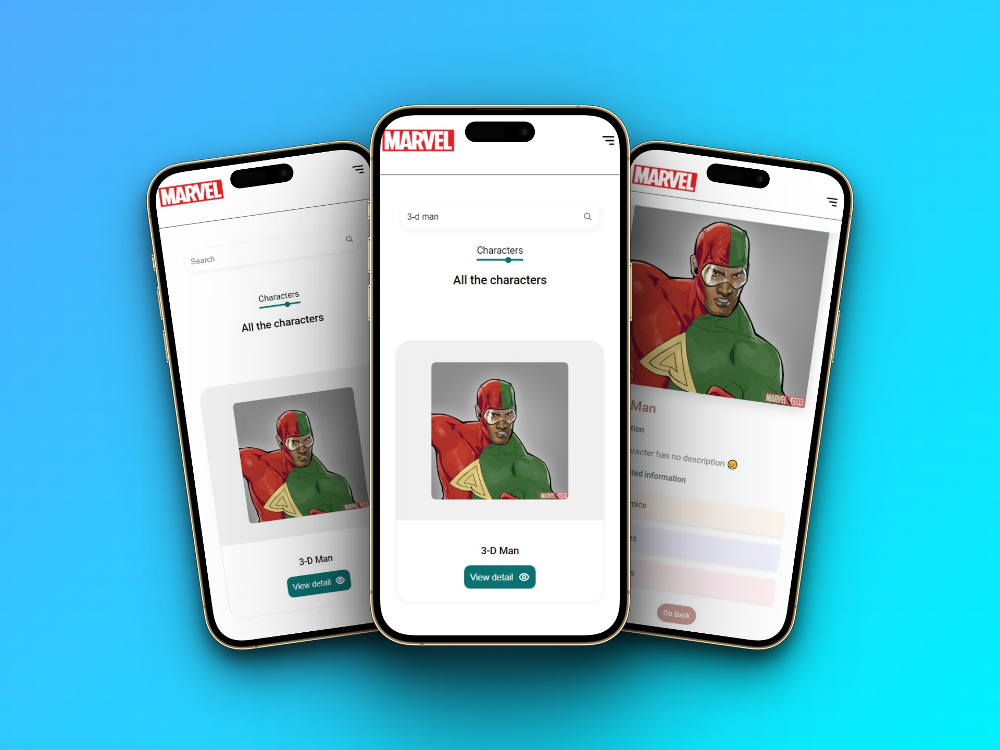
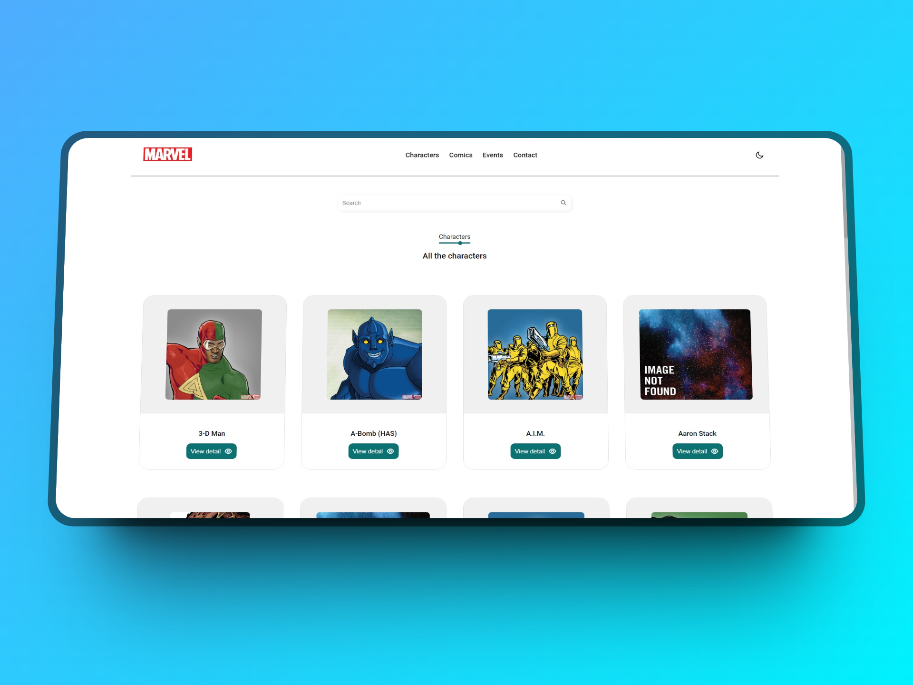
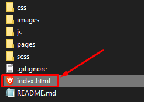

# LegendsAssemble

Welcome to **LegendsAssemble** 🌟

Immerse yourself in the exciting Marvel universe with LegendsAssemble. This app allows you to explore and discover detailed information about your favorite Marvel characters, events, and comics.

## Main features

- Explore a vast database of Marvel characters, comics, and events, with the help of the [API](https://developer.marvel.com/account).
- Discover classic and modern characters, along with their details and covers.
- Stay up to date with the latest Marvel comics and relevant information.

## Screenshots

### 1. Mobile view 📱



### 2. Desktop view 🖥️



## Use

1. Clone this repository: `git clone https://github.com/AnthonyAvellaneda10/LegendsAssemble.git`

```shell
git clone https://github.com/AnthonyAvellaneda10/LegendsAssemble.git
```

2. Navigate to the project folder: `cd LegendsAssemble`

```shell
cd LegendsAssemble
```

3. Open the `index.html` file in your browser.




## Contributions

Contributions are welcome! If you want to improve LegendsAssemble, open a pull request. Before you contribute, be sure to read our contribution guidelines.

---

Created with passion for [Anthony Avellaneda](https://www.linkedin.com/in/AnthonyAvellanedaPaitán/).
